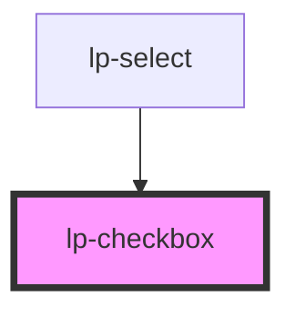

# lp-checkbox

```js
import '@liveperson-design-system/components/checkbox';
```

<!-- Auto Generated Below -->


## Properties

| Property        | Attribute        | Description                        | Type                | Default     |
| --------------- | ---------------- | ---------------------------------- | ------------------- | ----------- |
| `checked`       | `checked`        |                                    | `boolean`           | `undefined` |
| `error`         | `error`          |                                    | `boolean`           | `undefined` |
| `indeterminate` | `indeterminate`  |                                    | `boolean`           | `undefined` |
| `label`         | `label`          | Can be provided as a child element | `string`            | `undefined` |
| `labelPosition` | `label-position` |                                    | `"left" \| "right"` | `undefined` |
| `theme`         | `theme`          |                                    | `"dark" \| "light"` | `undefined` |


## Events

| Event    | Description | Type               |
| -------- | ----------- | ------------------ |
| `change` |             | `CustomEvent<any>` |


## Dependencies

### Used by

 - [lp-select](../select)

### Graph


----------------------------------------------


