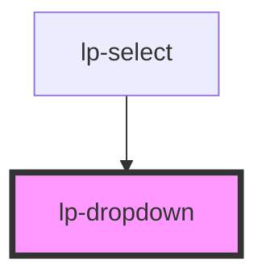

# lp-dropdown

```js
import '@liveperson-design-system/components/dropdown';
```

<!-- Auto Generated Below -->


## Properties

| Property              | Attribute                | Description | Type                                               | Default     |
| --------------------- | ------------------------ | ----------- | -------------------------------------------------- | ----------- |
| `closeOnBlur`         | `close-on-blur`          |             | `boolean`                                          | `true`      |
| `closeOnContentClick` | `close-on-content-click` |             | `boolean`                                          | `true`      |
| `closeOnEscape`       | `close-on-escape`        |             | `boolean`                                          | `true`      |
| `contentPlacement`    | `content-placement`      |             | `"auto" \| "bottom" \| "left" \| "right" \| "top"` | `'auto'`    |
| `open`                | `open`                   |             | `boolean`                                          | `undefined` |
| `parentOffset`        | `parent-offset`          |             | `number \| string`                                 | `15`        |
| `parentSelector`      | `parent-selector`        |             | `string`                                           | `undefined` |


## Events

| Event          | Description | Type               |
| -------------- | ----------- | ------------------ |
| `clickOutside` |             | `CustomEvent<any>` |
| `close`        |             | `CustomEvent<any>` |
| `open`         |             | `CustomEvent<any>` |


## Methods

### `dropdownClose() => Promise<void>`


#### Returns

Type: `Promise<void>`


### `dropdownOpen() => Promise<void>`


#### Returns

Type: `Promise<void>`


## Shadow Parts

| Part        | Description |
| ----------- | ----------- |
| `"content"` |             |


## Dependencies

### Used by

 - [lp-select](../select)

### Graph


----------------------------------------------


