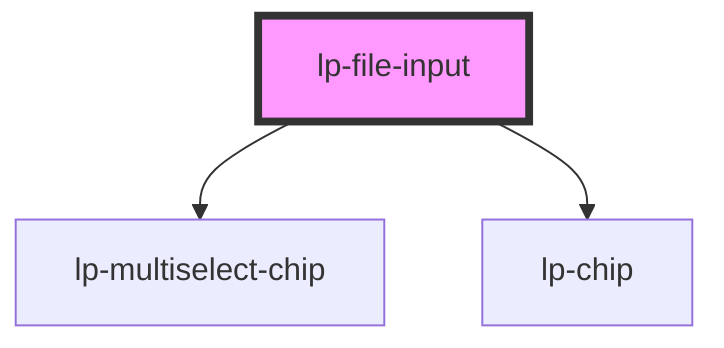

# lp-file-input

```js
import '@liveperson-design-system/components/file-input';
```

<!-- Auto Generated Below -->


## Properties

| Property               | Attribute                | Description                        | Type                  | Default              |
| ---------------------- | ------------------------ | ---------------------------------- | --------------------- | -------------------- |
| `buttonLabel`          | `button-label`           | Can be provided as a child element | `string`              | `'Choose a file...'` |
| `disabled`             | `disabled`               |                                    | `boolean`             | `undefined`          |
| `error`                | `error`                  |                                    | `boolean`             | `undefined`          |
| `multiple`             | `multiple`               |                                    | `boolean`             | `undefined`          |
| `readonly`             | `readonly`               |                                    | `boolean`             | `undefined`          |
| `size`                 | `size`                   |                                    | `"large" \| "medium"` | `undefined`          |
| `theme`                | `theme`                  |                                    | `"dark" \| "light"`   | `undefined`          |
| `uploading`            | `uploading`              |                                    | `boolean`             | `false`              |
| `uploadingButtonLabel` | `uploading-button-label` | Can be provided as a child element | `string`              | `'Uploading...'`     |
| `uploadingProgress`    | `uploading-progress`     |                                    | `number \| string`    | `0`                  |


## Shadow Parts

| Part                       | Description |
| -------------------------- | ----------- |
| `"file-upload-button"`     |             |
| `"selected-files"`         |             |
| `"uploading-progress-bar"` |             |


## Dependencies

### Depends on

- [lp-multiselect-chip](../multiselect-chip)
- [lp-chip](../multiselect-chip)

### Graph


----------------------------------------------


