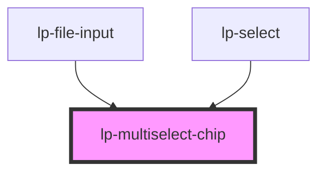

# lp-multiselect-chip

```js
import '@liveperson-design-system/components/multiselect-chip';
```

<!-- Auto Generated Below -->


## Properties

| Property | Attribute | Description | Type                   | Default     |
| -------- | --------- | ----------- | ---------------------- | ----------- |
| `size`   | `size`    |             | `"default" \| "small"` | `undefined` |
| `theme`  | `theme`   |             | `"dark" \| "light"`    | `undefined` |


## Dependencies

### Used by

 - [lp-file-input](../file-input)
 - [lp-select](../select)

### Graph


----------------------------------------------


